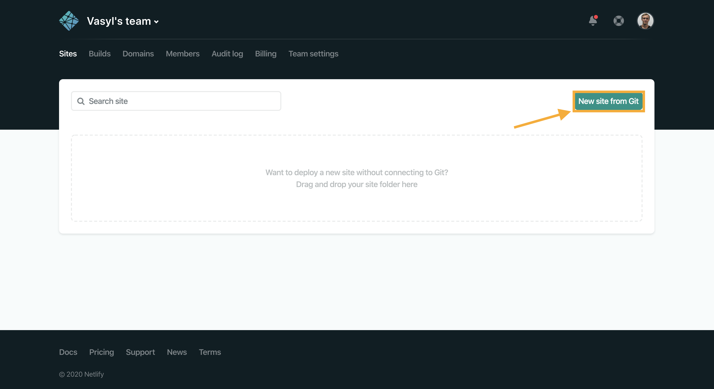
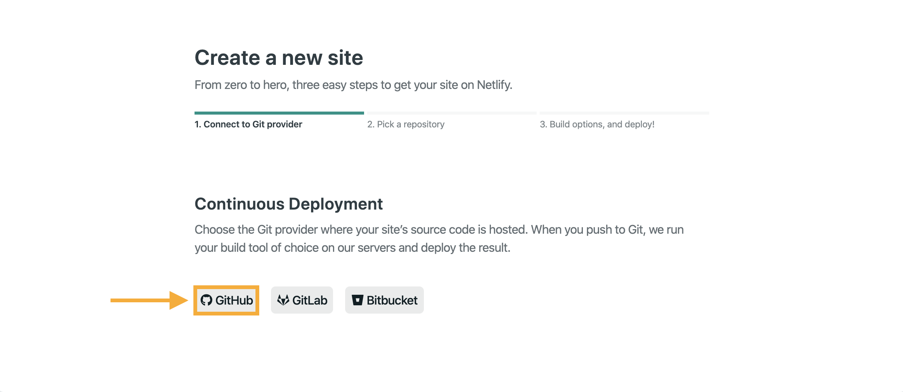
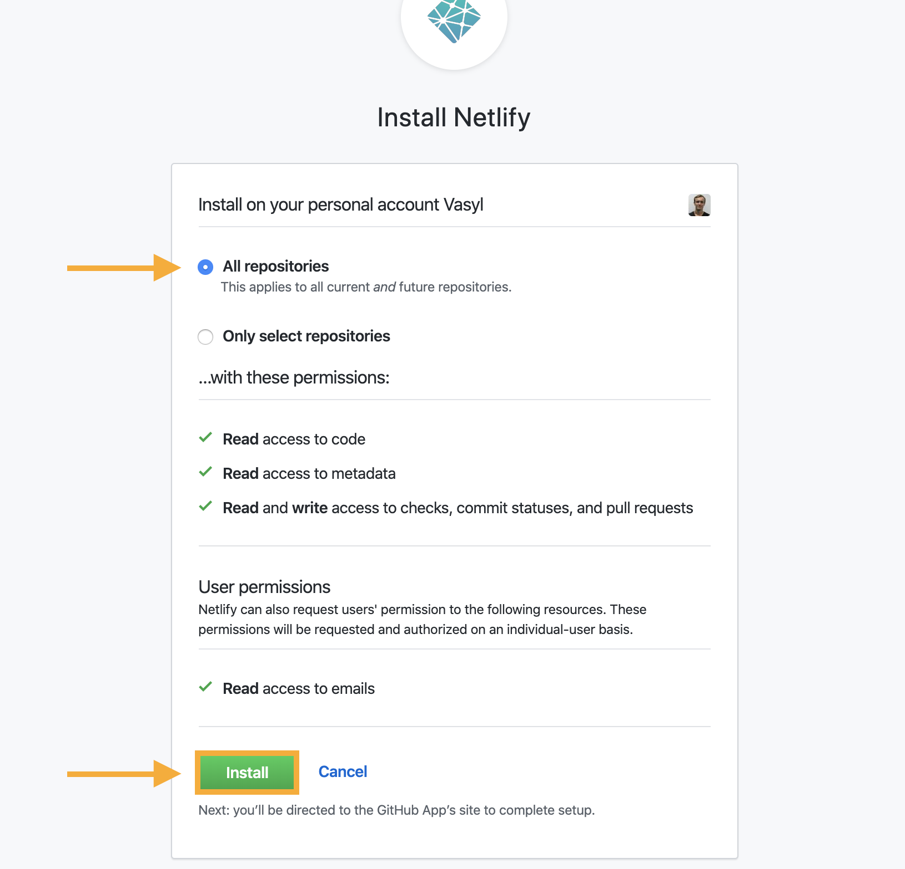
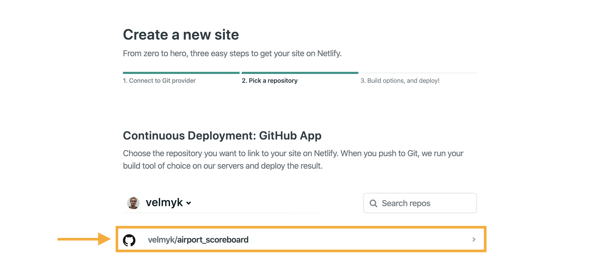
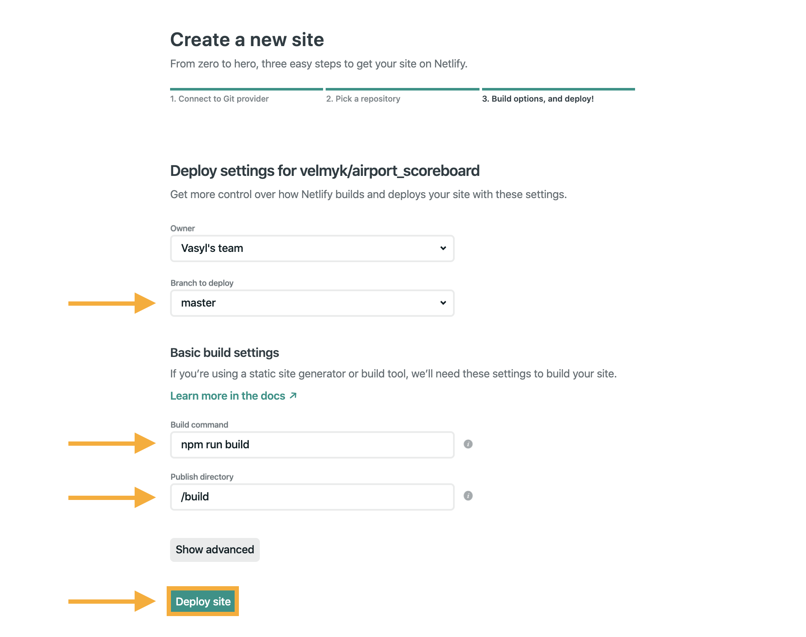
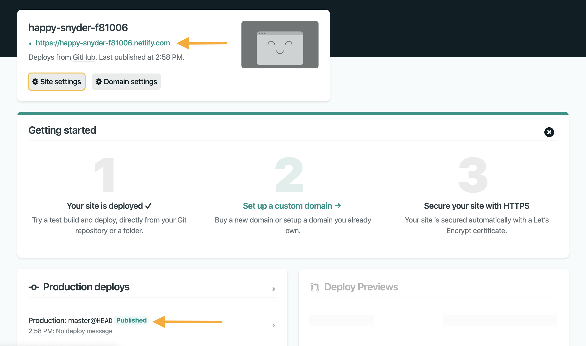
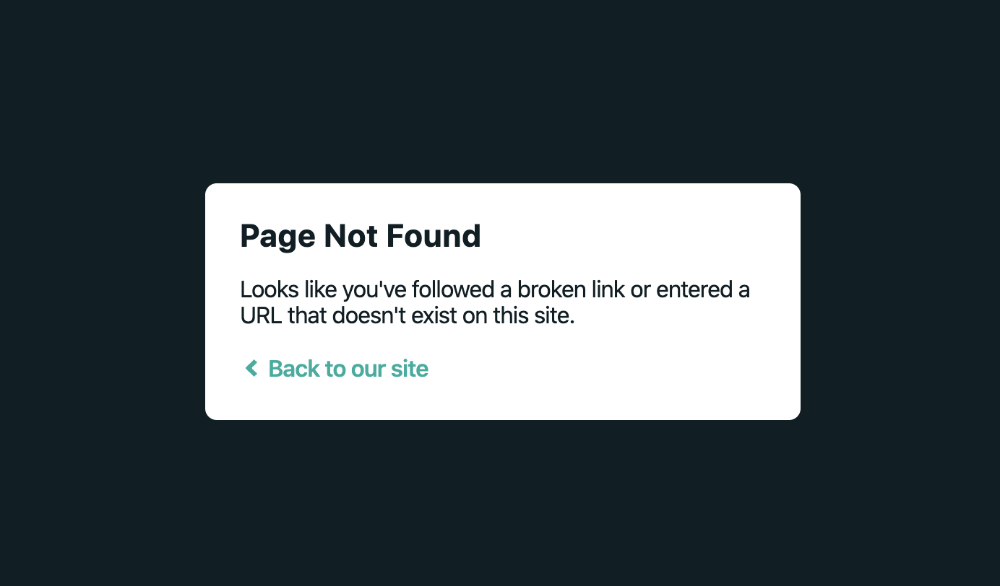

## Host SPA on Netlify ##

Для хостинга статического сайта вполне подойдет Github Pages. Но SPA Github Pages не поддерживает из-за отсутствия поддержки клиентского роутинга (например React Router)

### 1. Зарегистрируйтесь на [netlify.com](https://www.netlify.com/)

### 2. Нажимаем "New site from Git"



### 3. Выбираем "Github"



### 4. Выбор репозитория на Github
На этом шаге вас перенаправит на Github. Там нужно будет указать Вашего пользователя Github и репозитории, которые вы хотите деплоить. Можно выбрать опцию "All repositories"



### 5. Выбор репозитория для deploy
Дальше Вас должно перенаправить обратно на [netlify.com](https://www.netlify.com/) и здесь в списке появятся все репозитории, к которым вы открыли доступ на [github.com](https://www.github.com/)



### 6. Настройка deploy
Дальше вы увидите окно настроек, где нужно:
  -  выбрать ветку, с которой брать исходный код
  - команду, которую запустить для сборки проекта
  - папку, в которую попадают файлы сборки



### 7. Publish
Нажимаем кнопку "Deploy site" - и это все) Подождите, пока сайт задеплоится (до минуты). Когда увидите зеленую лейбочку "Published", можно переходить по ссылке на сайт



### 8. Обновление кода
Дальше каждый раз, когда вы будете пушить изменения в "master" (ветка, указанная в на 6-ом шагу), изменения будут подхвачены и обновится сайт

### 9. Проблемка
С такой настройкой все будет хорошо, пока вы не перейдете на какой-то роут и перезагрузите страницу. Это произошло потому, что пока хостинг работает не как SPA. Чтобы это исправить, перейдите на шаг `10`, если вы используете `create-react-app`, или на шаг `11`, если у вас своя настройка сборки



### 10. Настройка redirect для Create React App
Добавьте файл с названием `_redirects` в папку `public`. Содержание файла:
```
/*    /index.html   200
```
Сделайте commit и push в `master`. [netlify.com](https://www.netlify.com/) задеплоит изменения (до минуты) и роутинг будет работать. Теперь точно все 😉

### 11. Настройка redirect для кастомной настройки webpack
Добавьте файл с названием `_redirects` в корень проекта. Содержание файла:
```
/*    /index.html   200
```
Настройте `webpack`, чтобы он скопировал этот файл в папку сборки.
1. Установите `copy-webpack-plugin`
```
npm install copy-webpack-plugin --save-dev
```
2. Добавьте `CopyPlugin` в массив плагинов в `webpack.config.js`
```
const CopyPlugin = require('copy-webpack-plugin');

module.exports = {
  // ...
  plugins: [
    // ...
    new CopyPlugin([{ from: '_redirects', to: '' }]),
  ],
};
```
Такая настройка для `CopyPlugin` будет работать, если Ваш `webpack.config.js` тоже лежит в корне проекта

Сделайте commit и push в `master`. [netlify.com](https://www.netlify.com/) задеплоит изменения (до минуты) и роутинг будет работать. Теперь точно все 😉

