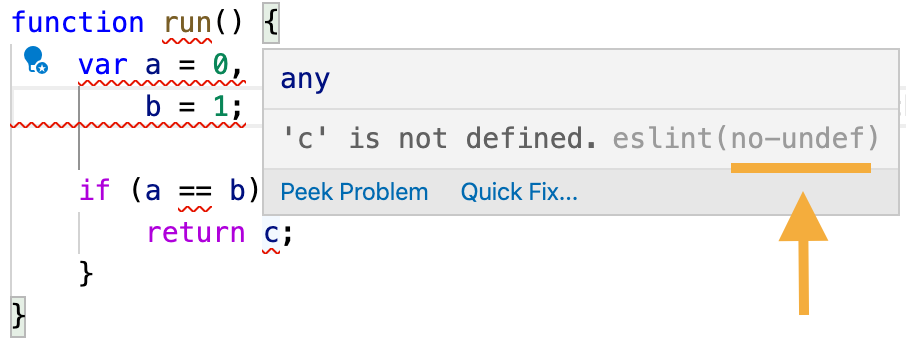

1. Установи LTS (Latest) версию `nodejs` (https://nodejs.org/en/)

2. В терминале перейди в корневую папку проекта

3. Вызови команду `npm init -y`. Эта команда создаст файл `package.json`

4. Дальше установи необходимые пакеты командой `npm install eslint eslint-config-airbnb-base eslint-plugin-import eslint-config-prettier eslint-plugin-prettier prettier`

5. Добавь файл с названием `.eslintrc.js` в корневую папку проекта с содержимым - это конфиг ESLint

```
module.exports = {
  extends: ['airbnb-base', 'plugin:prettier/recommended'],
  env: {
    es6: true,
    jest: true,
    browser: true,
  },
  rules: {
    'no-alert': 0,
    'no-console': 0,
    'no-constant-condition': 0,
    'no-shadow': 0,
    'no-restricted-globals': 0,
    'no-unused-vars': 0,
    'no-underscore-dangle': 0,
    'func-names': 0,
    'global-require': 0,
    'import/extensions': 0,
    'import/no-dynamic-require': 0,
    'import/prefer-default-export': 0,
    'prefer-template': 0,
    'prettier/prettier': [
      'warn',
      {
        'endOfLine': 'auto'
      }
    ]
  },
};
```

6. Установи [плагин для VSCode](https://marketplace.visualstudio.com/items?itemName=dbaeumer.vscode-eslint)

7. Перезагрузи VSCode

8. Теперь в редакторе будут подчеркиваться красным синтаксические ошибки в коде. Так же будут подчеркиваться те части кода, которые написаны не лучшим образом и могут привести к ошибкам

9. Чтобы убедиться, что все сработало, вставь следующий кусок в любой `.js` файл. В этой ф-ции плохо все и все должно подсвечиваться красным

```
function run() {
    var a = 0,
        b = 1;

    if (a == b) {
        return c;
    }
}
```



10. Когда какой-то участок кода подсвечивается красным - это означает, что код написан не лучшим образом. Лучше сразу исправить. Чтобы понять, как исправить, наведи на красный код курсор мыши. Появится popup с информацией об ошибке и ее идентификатор (на картинке подчеркнут линией `eslint(no-undef)`). В Google ищи `eslint no-undef`. Ты попадешь на сайт с документацией по ESLint. Там будет полное описание ошибки
